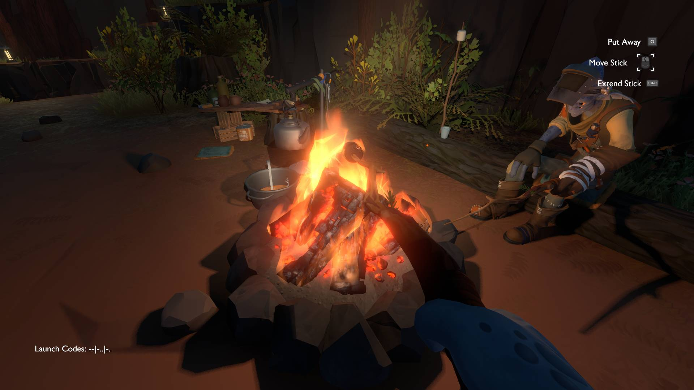

# Outer Wilds

Outer Wilds is an amazing game. It is an open world space exploration game, with many unique mechanics. While I could discuss these mechanics, they aren't what makes the game special. What makes it special is the way you slowly discover the story of the game. Theoretically this could have been done without the many special mechanics, but the mechanics help add to the discovery, and bring this game from merely special to truly amazing. While there are many games focusing on slowly learning about a world, I am pretty sure none do it like Outer Wilds. In most games focused on learning, there are two ways to go about teaching about the world. One is to have an abstract puzzle represent discovering things, and when you complete the puzzle there will be some exposition, or there will be some kind of normal video game challenge, and when you finish it, you will find a book or another character to give you exposition. That isn't how it works in Outer Wilds. In Outer Wilds, each piece of information is only a couple sentences long, and isn't very hard to find. Maybe you'll find some text inscribed on a wall mentioning an experiment on the south pole of a planet, or a character will tell you about a path to an ancient city starting from the equator. You will find tons of these scattered throughout the game, many of which are available easily from the start. So you have a choice of which lead to follow. Conveniently, the log on the ship you're on has a list of all the information you gather, so you don't need to constantly waste time going back to remember stuff if you don't take notes. This means you can just turn around and check if you're getting stuck on one path, because there will be a bunch others for you to follow. So let's say you want to find the path from the equator to the city, but keep falling into holes and dying or getting stuck on the way, so you don't want to work on it any more. Never fear, as you can change your mind and head to that south pole you heard about, and see what's going on there! Now, the best part is, if you follow each of the hints to their end, you can find another piece of information, leading you somewhere else! This goes down a couple layers before you reach hints about beating the game, which is technically possible without following any of the hints, but you just need to find out by reading the hints! This is another way it stands apart from other games involving discovery, in that the discovery directly leads to the end of the game!

Now, I haven't even talked about the other thing that sets Outer Wilds apart from not just other discovery games, but almost all other games in general! The dynamic world. Now, while many games have worlds that can change in minor ways as a result of the player's actions, but in Outer Wilds, the world changes by itself. For example, there is a planet that slowly falls apart over twenty minutes, preventing certain paths from being followed, but also causing certain roadblocks to fall apart. Now, this might seem like a bad idea, preventing players from accessing the things that dissolve early if they don't discover them until later into the game, but this is solved by the last unique mechanic. The time loop. Outer Wilds runs on a time loop, where every twenty minutes, the entire world resets, and you wake up back on the starting planet, with only your knowledge intact. This means that if you find a place, but it's destroyed by the passage of time, you just wait until the world resets, and try to get there as fast as possible. This is probably the least interesting of the features in Outer Wilds, but it really brings everything together, making learning about the world the only thing that matters to progress in the game.

{:height="360px" width="640px"}
