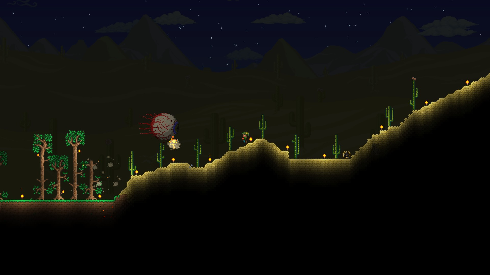

# Terraria

Terraria is often seen as 2D Minecraft. However, Terraria is far more than that in several ways. Terraria is, at its core, an adventure game. While you can build things in Terraria, it's just a feature to go alongside its main feature of battling monsters, unlike Minecraft, where battling monsters is the side feature. This makes the two games incredibly different, and not able to be compared, so I will not be comparing them for the remainder of this review.

In Terraria, you start incredibly weak, and will die a lot. However, death isn't that big of a deal, as you will come right back with all of your stuff, other than losing a bit of money. This starting weakness makes several areas in the game which are technically available from the start nearly impossible to explore due to powerful enemies. This makes it so that when you start, you're basically stuck exploring the forest you start in, and gathering resources there to get stronger. Now, while I said earlier that the point of Terraria is fighting monsters, that isn't completely true. The main point of Terraria is getting stronger. This is a constant presence in the game, with early things such as upgrading your copper shortsword to a wooden longsword, but this idea of constant upgrading continues until the end of the game. At the beginning of Terraria, after you gather some basic wooden armor and weapons, you spend most of your time spelunking for better equipment. The caves in Terraria vary a lot depending on where you are, but always have enemies to fight, ores to mine, and loot to gather. However, depending on the biome, the enemies and loot can differ. For example, in an Ice biome, you'll be battling against ice-themed enemies, and gathering equipment such as Ice Skates and the Ice Blade, while in the Jungle, you'll be battling Hornets and Bats, and gathering a lot of nature themed equipment. This keeps your spelunking exciting as you go between biomes.

After you have gathered better equipment from spelunking, you'll probably be ready to do the thing Terraria is best at, a boss fight. There are 31 bosses in the game, and are the primary way to progress. Each boss you defeat will give you better equipment, however many will unlock dangerous new areas of the world. For example, a boss called Skeletron unlocks the Dungeon, an area which was previously inaccessible due to unbreakable blocks, which contains several powerful weapons, as well as many powerful enemies. Each boss in Terraria will require a lot of strategy to defeat, both in picking the weapons to use against them, and in the fight itself. For example, the first main boss, the Eye of Cthulhu, is constantly flying. This makes it so that swords are very difficult to hit it with. However, Grenades, a weapon previously useless due to its bad aim, is incredibly useful against it due to its large hitbox. Almost every boss has a trick like this that makes defeating them far easier, which is an intended feature of the game. As well as this, the ability to build makes it so you can construct arenas for boss fights which will make it so the battle is more in your favor, by adding platforms so you can always maneuver around the boss, or by adding items that make you heal faster. Again, none of this is necessary, but is an intended feature of the game as a way to put effort into making the boss fights more doable.

As each boss is harder than the one before it, and there are 31 of them, the amount that you get stronger from the beginning of the game to the end is immense. At the beginning of the game, you have nothing but some copper tools, but by the end of the game you're nearly invincible, can fly wherever you want, and can destroy nearly any enemy with ease. This sense of slowly growing power is what makes Terraria such a fun game.

{:height="360px" width="640px"}
